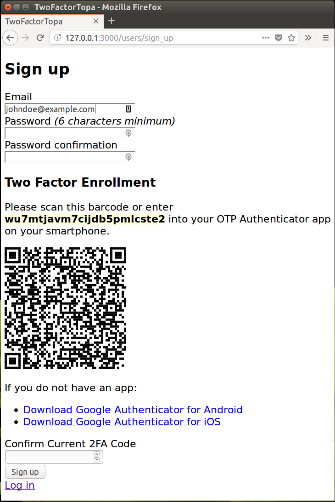
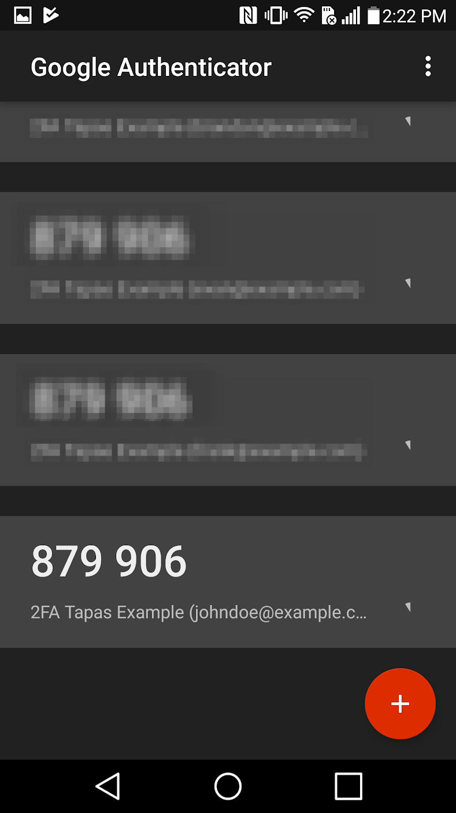

# RubyTapas #534 - Two Factor Authentication Demo Application

## Important Security Notice

**WARNING!** This demo application is an instructional example intended to demonstrate adding two factor authentication to
a Rails application. It is not production code and should not
just be copied and pasted into your production apps without understanding. The author also has not audited the implementation
for all security issues.

## Demo Setup

Everything you need to access the demo is setup by the `bin/setup` script.

Run the following
```bash
bundle && bin/setup
```

It will set a randomly generated OTP encryption key in the .env file,
and generate an enrolled user. Follow the instructions in the last
paragraph to add the OTP secret to your smartphone app and access the demo.

You will see...
```
== Installing dependencies ==
The Gemfile's dependencies are satisfied

== Preparing database ==
Database 'db/development.sqlite3' already exists
Database 'db/test.sqlite3' already exists
-- create_table("users", {:force=>:cascade})
   -> 0.0289s
-- create_table("users", {:force=>:cascade})
   -> 0.0278s

== Removing old logs and tempfiles ==

== Generating a Development Only Encryption Secret for .env

 Setting devonly encryption secret
OTP_SECRET_ENCRYPTION_KEY=devonly:06f7a8d6f7f0f8134dda8ce3acf41d9e22c1dcc80a80ffc8c0780262f5b2

== Restarting application server ==

== Setting up the sample user and 2FA code

Add the following OTP secret to your smartphone app:

r7zm6xn4ijt7gscm6lvpnobo

Once that is complete, you can login with:
E-mail: rubyist@example.com
Password: 25efe0794d
OTP Code: <the current six digit code from your app>
 Demo only cheat, you can use 950419 for the next minute
```

## User Signup with 2FA Enrollment
The demo provides for user signup with 2FA verification in a one-stop page.



After scanning the barcode with Google Authenticator on Android, smartphone shows the
matching TOTP code that changes every minute.



The user has to type the currently matching 6 digit code from the app to be able to
create the user account.
